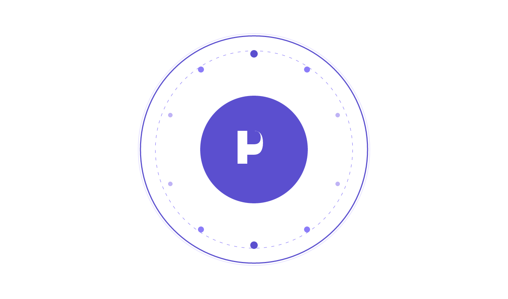

<div align="center">
  
  <h1>PublishOS</h1>
  <p><strong>All-in-one content creation & social media management platform</strong></p>
  <p>Write, enhance with AI, schedule, and publish to LinkedIn, YouTube, and more — from a single dashboard.</p>
</div>

---

## ✨ Features

### 📝 Content Management
- **Rich post editor** — Create, edit, and manage posts with title, message, tags, and media
- **AI Studio** — Generate captions, rewrite, repurpose, and enhance posts using AI (OpenAI / OpenRouter)
- **Infinite-scroll feed** — Posts load 10 at a time with smooth pagination

### 📅 Scheduling & Calendar
- **Visual calendar** — Month view with dot indicators for scheduled posts
- **Schedule posts** — Pick date/time and target platform, edit or delete anytime
- **Upcoming posts sidebar** — Quick preview of what's queued

### 🔗 Platform Integrations
| Platform | Status | Features |
|----------|--------|----------|
| **LinkedIn** | ✅ Live | OAuth connect, text + image posts, media upload |
| **YouTube** | ✅ Live | OAuth connect, video upload, shorts support, analytics |
| Twitter/X | 🚧 Planned | |
| Instagram | 🚧 Planned | |
| Facebook | 🚧 Planned | |

### 📊 Analytics
- Dashboard overview with engagement metrics
- Content performance tracking
- Creator insights
- YouTube-specific analytics (views, watch time, subscriber gains)

### 👤 User System
- Email/password authentication
- Google OAuth sign-in
- Profile management
- Settings (theme, notifications, connected accounts)

---

## 🧱 Tech Stack

| Layer | Technology |
|-------|-----------|
| **Frontend** | React 18, Material UI v5, Redux (Thunk), React Router v7 |
| **Backend** | Node.js, Express 4, Mongoose 8 |
| **Database** | MongoDB Atlas |
| **Auth** | JWT + Google OAuth (`@react-oauth/google`) |
| **AI** | OpenAI API / OpenRouter |
| **Styling** | 100% MUI `sx` prop — no CSS modules |

---

## 🚀 Getting Started

### Prerequisites
- Node.js 18+
- MongoDB connection string
- Google OAuth client ID (for YouTube integration)
- LinkedIn developer app credentials
- OpenRouter or OpenAI API key (for AI features)

### 1. Clone & Install

```bash
git clone https://github.com/Fethulmubin/PublishOS.git
cd PublishOS

# Server
cd Server
npm install

# Client
cd ../Client/Memories
npm install
```

### 2. Environment Variables

Create `Server/.env`:

```env
CONNECTION_URL="mongodb+srv://..."
JWT_SECRET="your_jwt_secret"

FRONTEND_URL="http://localhost:5173"

# LinkedIn
LINKEDIN_CLIENT_ID="..."
LINKEDIN_CLIENT_SECRET="..."
LINKEDIN_REDIRECT_URI="http://localhost:5555/api/integrations/auth/linkedin/callback"

# Google / YouTube
YOUTUBE_CLIENT_ID="..."
YOUTUBE_CLIENT_SECRET="..."
YOUTUBE_REDIRECT_URI="http://localhost:5555/api/integrations/auth/youtube/callback"
YOUTUBE_SCOPES="openid profile email https://www.googleapis.com/auth/youtube.upload https://www.googleapis.com/auth/youtube.readonly https://www.googleapis.com/auth/yt-analytics.readonly"

# Shared Google URLs
GOOGLE_AUTH_URL="https://accounts.google.com/o/oauth2/v2/auth"
GOOGLE_TOKEN_URL="https://oauth2.googleapis.com/token"
GOOGLE_USERINFO_URL="https://www.googleapis.com/oauth2/v3/userinfo"

# AI
OPENROUTER_API_KEY="sk-or-v1-..."
```

### 3. Run

```bash
# Terminal 1 — Server
cd Server
npm start        # http://localhost:5555

# Terminal 2 — Client
cd Client/Memories
npm run dev      # http://localhost:5173
```

### 4. OAuth Setup

#### LinkedIn
1. Create an app at [LinkedIn Developer Portal](https://www.linkedin.com/developers/)
2. Add redirect URI: `http://localhost:5555/api/integrations/auth/linkedin/callback`
3. Request `w_member_social`, `openid`, `profile`, `email` scopes

#### YouTube (Google)
1. Enable **YouTube Data API v3** and **YouTube Analytics API** in [Google Cloud Console](https://console.cloud.google.com/)
2. Create an **OAuth 2.0 Client ID** (Web application)
3. Add redirect URI: `http://localhost:5555/api/integrations/auth/youtube/callback`
4. Add your Google email as a **Test user** on the OAuth consent screen

---

## 📁 Project Structure

```
Server/
├── controllers/        # Route handlers
│   ├── post.js         # CRUD + pagination
│   ├── integrations.js # LinkedIn, YouTube, OAuth
│   ├── schedule.js     # Scheduled posts
│   └── aiStudio.js     # AI generation endpoints
├── services/
│   └── integrations/
│       ├── linkedin/   # LinkedIn API wrapper
│       └── youtube/    # YouTube API wrapper (upload, analytics)
├── models/             # Mongoose schemas
├── middleware/         # JWT + Google auth
└── routes/

Client/Memories/src/
├── api/                # Axios instance + all API functions
├── actions/            # Redux thunk actions
├── reducers/           # Redux reducers
├── components/
│   ├── Auth/           # Login / Signup
│   ├── Common/         # Reusable: dialogs, cards, sidebar widgets
│   ├── Form/           # Post create/edit form
│   ├── Home/           # Feed page
│   ├── Layout/         # Sidebar + TopHeader + content shell
│   ├── NavBar/         # Top header
│   ├── NavBottom/      # Mobile bottom nav
│   ├── Pages/          # Dashboard, AIStudio, Schedule, Analytics, etc.
│   ├── Posts/          # Post card + list + infinite scroll
│   └── Sidebar/        # Left navigation drawer
└── assets/             # Logos, images
```

---

## 🔌 API Endpoints

### Authentication
| Method | Endpoint | Auth |
|--------|----------|------|
| POST | `/users/signin` | — |
| POST | `/users/signup` | — |

### Posts (paginated)
| Method | Endpoint | Auth | Description |
|--------|----------|------|-------------|
| GET | `/posts?page=1&limit=10` | — | Fetch paginated posts |
| POST | `/posts` | ✅ | Create post |
| PATCH | `/posts/:id` | ✅ | Update own post |
| DELETE | `/posts/:id` | ✅ | Delete own post |
| PATCH | `/posts/:id/like` | ✅ | Toggle like |

### Schedule
| Method | Endpoint | Auth |
|--------|----------|------|
| GET | `/api/schedule` | ✅ |
| POST | `/api/schedule` | ✅ |
| PATCH | `/api/schedule/:id` | ✅ |
| DELETE | `/api/schedule/:id` | ✅ |

### Integrations
| Method | Endpoint | Auth |
|--------|----------|------|
| GET | `/api/integrations` | ✅ | Connected accounts |
| GET | `/api/integrations/auth/:platform/url` | ✅ | OAuth URL |
| GET | `/api/integrations/auth/:platform/callback` | — | OAuth callback |
| POST | `/api/integrations/linkedin/post` | ✅ | Publish to LinkedIn |
| POST | `/api/integrations/youtube/post` | ✅ | Upload video |
| GET | `/api/integrations/youtube/analytics` | ✅ | YouTube analytics |
| GET | `/api/integrations/youtube/videos` | ✅ | List videos |
| DELETE | `/api/integrations/disconnect/:platform` | ✅ | Disconnect platform |

### AI Studio
| Method | Endpoint | Auth |
|--------|----------|------|
| POST | `/api/ai/generate` | ✅ |
| POST | `/api/ai/generate-caption` | ✅ |
| POST | `/api/ai/rewrite` | ✅ |
| POST | `/api/ai/repurpose` | ✅ |
| POST | `/api/ai/structure` | ✅ |
| PATCH | `/api/ai/enhance-post/:id` | ✅ |

---

## 🤝 Contributing

1. Fork the repository
2. Create a feature branch (`git checkout -b feature/amazing-feature`)
3. Commit your changes (`git commit -m 'Add amazing feature'`)
4. Push to the branch (`git push origin feature/amazing-feature`)
5. Open a Pull Request

---

## 📄 License

This project is licensed under the MIT License.
